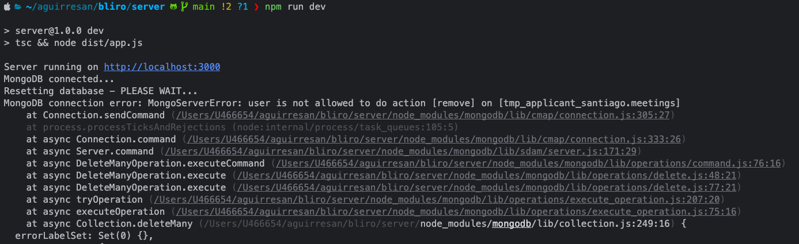

# Submission - Santiago Aguirre Lamus

## Steps taken
To takle on the challenge, I followed these steps:
I started by reading the problem statement and understanding the requirements. 
The, I tried to get the system up and running by installing the necessary dependencies.
I noticed that there was a package missing in the server, so I added it. Once I managed to connect to the database, I 
noticed that the provided credentials were not working, so I modified the server code to use a local in-memory JSON file 
as database for testing purposes.

After that, I started implementing the frontend features.